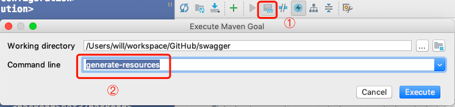
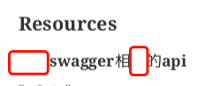
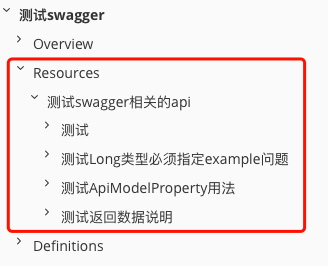
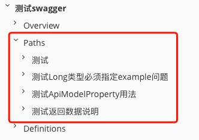
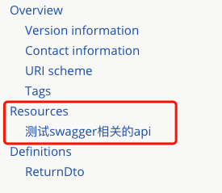

# swagger
## 介绍

> Swagger具备如下功能：
>
> + 在线生成restful风格接口文档
> + 对接口功能进行测试

## 使用

> 参考资料：
>
> + [微服务学习二：springboot与swagger2的集成 - 小虾米的java梦 - 博客园](https://www.cnblogs.com/fengli9998/p/7522973.html) 
> + [swagger搭建（基于springBoot）](https://blog.csdn.net/penyoudi1/article/details/79067386) 

+ pom

  ```xml
  <dependency>
      <groupId>io.springfox</groupId>
      <artifactId>springfox-swagger-ui</artifactId>
      <version>2.9.2</version>
  </dependency>
  <dependency>
      <groupId>io.springfox</groupId>
      <artifactId>springfox-swagger2</artifactId>
      <version>2.9.2</version>
  </dependency>
  ```

+ `Swagger2配置类`

  ```java
  @Configuration
  @EnableSwagger2
  public class Swagger2 {
      @Bean
      public Docket createRestApi() {
          return new Docket(DocumentationType.SWAGGER_2)
                  .apiInfo(apiInfo())
                  .select()
                  //为当前包路径
                  .apis(RequestHandlerSelectors.basePackage("com.shuyan.swagger"))
                  .paths(PathSelectors.any())
                  .build();
      }
  
      private ApiInfo apiInfo() {
          return new ApiInfoBuilder()
                  //页面标题
                  .title("测试swagger")
                  //创建人、个人门户网站、邮箱
                  .contact(new Contact("Will", "https://www.github.com/Mshuyan", "434224591@qq.com"))
                  //版本号
                  .version("1.0")
                  //描述
                  .description("测试swagger使用")
                  .build();
      }
  }
  ```

+ `Controller`

  ```java
  @RestController
  @Api(tags = "测试swagger相关的api",description = "TestController")
  public class TestController {
  
      @ApiOperation(value = "根据关键字查询产品列表", notes = "根据关键字查询产品列表 note")
      @ApiImplicitParams({
              @ApiImplicitParam(name = "str", value = "要说的话", paramType = "query",required = true, dataType = "String")
      })
      // 当只有1个参数时，上面注解可替换为：
      // @ApiImplicitParam(name = "keywords", value = "关键字，以空格分割", required = true, dataType = "String")
  
      @GetMapping("/test")
      public String test(String str){
          return "you said " + str;
      }
  }
  ```

+ 启动项目并访问

  > 项目根路径  +  /swagger-ui.html
  >
  > 比如本次测试访问路径为`http://127.0.0.1:8080/api/swagger-ui.html`
  >
  > 结果如下图：

   

  > 代码中的配置在页面上都能找到对应的内容

## 对请求参数进行说明的2种方式

```java
@ApiOperation(value = "测试ApiModelProperty用法")
@GetMapping("/test1/{id}")
public String testApiModelProperty(TestDto dto ){
    return "you said " + dto.getId();
}

...
    
@Data
public class TestDto implements Serializable {
    private static final long serialVersionUID = 1L;
    @ApiModelProperty(value = "订单ID",example = "1")
    private Long id;
}
```

等效于

```java
@ApiOperation(value = "测试ApiModelProperty用法")
@ApiImplicitParam(name = "id", value = "订单ID", dataType = "Long",example = "1")
@GetMapping("/test1/{id}")
public String testApiModelProperty(TestDto dto ){
    return "you said " + dto.getId();
}
```

## Models

> swagger页面在接口下方有一栏显示`Models`
>
> 这里是将所有接口 **返回值** 涉及到的实体类在这里进行了说明
>
> 对返回值字段进行描述可以通过如下代码

```java
@Data
@ApiModel(description = "订单查询请求数据")
public class ReturnDto implements Serializable {
    private static final long serialVersionUID = 1L;
    @ApiModelProperty(value = "订单ID",example = "1")
    private Long id;
}
```


## 说明

### `@Api`

> `@Api`的`value`属性没作用，需要使用`tags`和`description`属性

### `paramType`

> 有效值有如下几种：

+ path，路径参数，如`/api/test/{id}`

+ query，url请求参数，如`/api/test?id=1`

  > query是`paramType`属性的默认值

+ body，

+ header，请求头参数

+ form，form表单参数

## 生产环境禁用swagger

> 参见[swagger搭建（基于springBoot）](https://blog.csdn.net/penyoudi1/article/details/79067386) 

+ 为什么禁用

  > swagger在开发过程中好用，但是生产环境下必须屏蔽swagger，不然很容易让人利用swagger执行对库操作，安全隐患非常大

+ 如何禁用

  > 在`swagger`配置类上加上条件注解实现生成环境禁用

  ```java
  @Configuration
  @EnableSwagger2
  @ConditionalOnProperty(prefix = "spring",value = {"profiles.active"},havingValue = "dev")
  public class Swagger2 {
      ......
  }
  ```

  > @ConditionalOnProperty作用
  >
  > 当配置文件中`spring.profiles.active`的值为`dev`时，加载该配置类

## 生成离线文档

> 参考资料：
>
> + [spring boot2.0+swagger自动生成PDF和HTML格式的API文档](https://blog.csdn.net/qq_29534483/article/details/81227308) 

### markdown

+ pom

  > 加入如下插件

  ```xml
  <plugin>
      <groupId>io.github.swagger2markup</groupId>
      <artifactId>swagger2markup-maven-plugin</artifactId>
      <version>1.3.3</version>
      <configuration>
          <!--此处端口一定要是当前项目启动所用的端口-->
          <swaggerInput>http://localhost:8080/api/v2/api-docs</swaggerInput>
          <outputFile>doc/api-docs/asciidoc/api</outputFile>
          <config>
              <!-- 除了ASCIIDOC之外，还有MARKDOWN和CONFLUENCE_MARKUP可选 -->
              <swagger2markup.markupLanguage>MARKDOWN</swagger2markup.markupLanguage>
              <swagger2markup.pathsGroupedBy>TAGS</swagger2markup.pathsGroupedBy>
          </config>
      </configuration>
  </plugin>
  
  ```

  + `swaggerInput`

    填入下面截图中的内容

     

  + `outputFile`

    指定生成文件的路径及文件名

  + `swagger2markup.markupLanguage`

    指定生成文件的格式，可选值：

    + ASCIIDOC

      > 生成html、pdf离线文档时需要先转到该格式，然后将该格式再转为html、pdf

    + MARKDOWN

    + CONFLUENCE_MARKUP

      > 生成的文件是txt格式，内容格式比较特殊，应该也是作为中间文件使用的，暂时用不到

+ 生成离线文档

  + 先启动项目

    > 启动项目后就可以正常访问在线文档了，也就能访问`swaggerInput`指定的接口了
    >
    > 该插件是从`swaggerInput`指定的接口中获取json数据来生成离线文档的

  + 执行插件

    > 执行`swagger2markup`插件，即可生成`markdown`格式的离线文档了

### pdf或html

> + 生成`pdf`或`html`离线文档的步骤为：
>   + 先生成`*.adoc`格式的离线文档
>   + 然后将`*.adoc`格式的离线文档转换为`pdf`或`html`

+ pom

  > 在[生成markdown离线文档](#markdown)的pom文件基础上，将`swagger2markup.markupLanguage`的值改为`ASCIIDOC`，修改后内容如下：

  ```xml
  <!--此插件生成ASCIIDOC-->
  <plugin>
      <groupId>io.github.swagger2markup</groupId>
      <artifactId>swagger2markup-maven-plugin</artifactId>
      <version>1.3.3</version>
      <configuration>
          <!--此处端口一定要是当前项目启动所用的端口-->
          <swaggerInput>http://localhost:8080/api/v2/api-docs</swaggerInput>
          <outputFile>doc/api-docs/asciidoc/api</outputFile>
          <config>
              <!-- 除了ASCIIDOC之外，还有MARKDOWN和CONFLUENCE_MARKUP可选 -->
              <swagger2markup.markupLanguage>ASCIIDOC</swagger2markup.markupLanguage>
          </config>
      </configuration>
  </plugin>
  ```

  > 然后添加另外1个插件，并进行配置

  ```xml
  <!--此插件生成HTML和PDF-->
  <plugin>
      <groupId>org.asciidoctor</groupId>
      <artifactId>asciidoctor-maven-plugin</artifactId>
      <version>1.5.3</version>
      <dependencies>
          <dependency>
              <groupId>org.asciidoctor</groupId>
              <artifactId>asciidoctorj-pdf</artifactId>
              <version>1.5.0-alpha.10.1</version>
          </dependency>
          <dependency>
              <groupId>org.jruby</groupId>
              <artifactId>jruby-complete</artifactId>
              <version>9.2.3.0</version>
          </dependency>
      </dependencies>
      <!-- 在这里指定要从哪个目录下读取文件进行转换 -->
      <configuration>
          <sourceDirectory>doc/api-docs/asciidoc</sourceDirectory>
          <sourceHighlighter>coderay</sourceHighlighter>
          <attributes>
              <toc>left</toc>
          </attributes>
      </configuration>
      <!-- 配置要执行的命令 -->
      <executions>
          <!-- 配置生成html的命令 -->
          <execution>
              <id>output-html</id>
              <phase>generate-resources</phase>
              <goals>
                  <goal>process-asciidoc</goal>
              </goals>
              <configuration>
                  <backend>html5</backend>
                  <!-- 配置生成文件的目录
   					 注意：这里配置的路径不可以与前面配置的读取文件的目录同级或是其子目录-->
                  <outputDirectory>doc/api-docs/html</outputDirectory>
              </configuration>
          </execution>
  
          <!-- 配置生成pdf的命令 -->
          <execution>
              <id>output-pdf</id>
              <phase>generate-resources</phase>
              <goals>
                  <goal>process-asciidoc</goal>
              </goals>
              <configuration>
                  <backend>pdf</backend>
                  <outputDirectory>doc/api-docs/pdf</outputDirectory>
              </configuration>
          </execution>
      </executions>
  </plugin>
  ```

+ 生成离线文档

  - 先启动项目，并生成`asciidoc`离线文档

    > 与[生成markdown离线文档](#markdown)中步骤相同
    >
    > + 启动项目
    > + 执行`swagger2markup`插件

  - 生成`pdf`或`html`离线文档

    > + 因为这步依赖上一步生成的`asciidoc`离线文档，所以这步必须后执行
    >
    > + 打开Maven窗口 → `Execute Maven Goal` → 输入`generate-resources`(也就是配置插件时`phase`标签的值) → `Execute`

     

### 解决pdf中文显示不正常

+ 问题

  > 生成的pdf中文有的无法正常显示，效果如下，圈中部分是有字的，但是显示不出来

   

+ 解决方案

  参见：[swagger+asciidoctor 导出PDF中文缺失乱码问题解决](https://blog.csdn.net/qq_29534483/article/details/81235081) 

  > 网上的办法都是通过替换`asciidoctorj-pdf`包中的字体文件解决，而且是在本地做的，协同开发时这种办法很不方便，所以这里就不研究了，使用`MarkDown`格式离线文档目前已经可以满足需求

### 生成文件目录结构

> 在`swagger2markup-maven`插件配置中，是否有如下配置，会影响生成文档的目录结构，而不同格式文档的影响效果还不同

```xml
<swagger2markup.pathsGroupedBy>TAGS</swagger2markup.pathsGroupedBy>
```

> 总结下来：
>
> + 生成markdown文档时，最好指定该配置，
>
>   + 这样会将所有接口按`Controller`类进行分类
>
>      
>
>   + 不指定也可以，所有接口都会一一列出，只不过不分类
>
>      
>
> + 生成pdf或html时，最好不要指定该配置，
>
>   + 指定时目录上就无法展示所有接口了，只将`Controller`类的@Api注解的`tags`属性列出，而该类下的接口无法再目录上列出
>
>      
>
>   + 如果不指定，所有接口都会一一列出
>
>      

## 采坑记录

### 数值类型转换出错

- 异常

  > java.lang.NumberFormatException: For input string: ""

- 解决方案

  > 在使用`@ApiImplicitParams`或`@ApiModelProperty`注解对`Long`类型属性进行说明时，必须指定`example`属性，并且必须为内容为数字的字符串

- 例

  ```java
  @ApiImplicitParam(name = "itemId", value = "产品id", paramType = "path", required = true, dataType = "Long",example = "0")
  ```