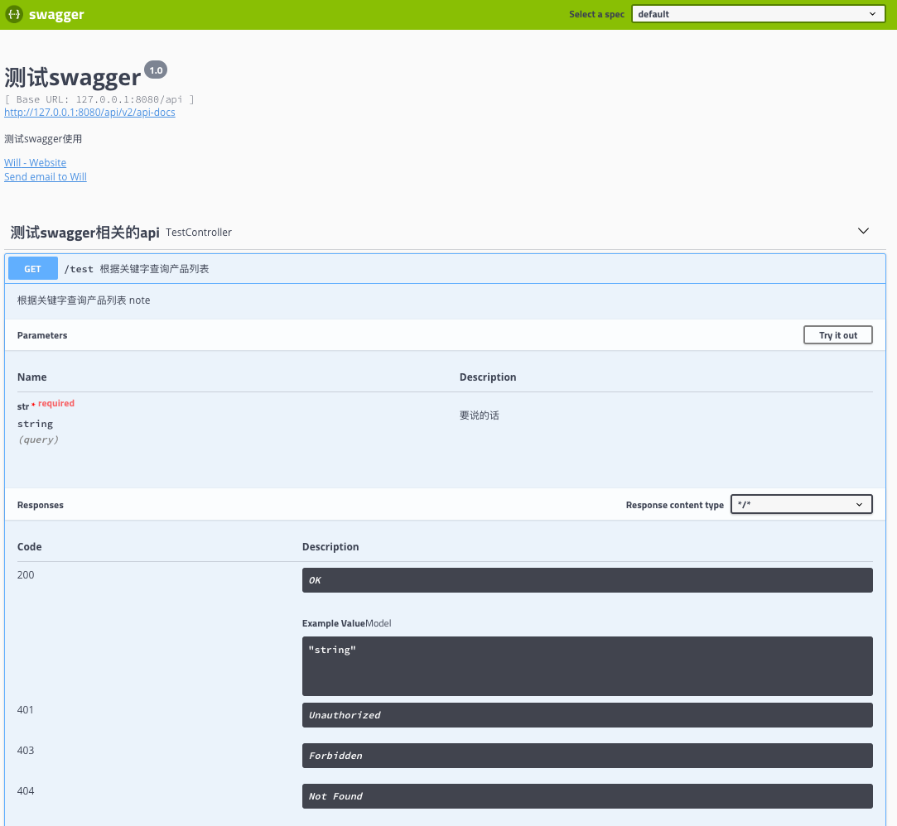
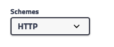
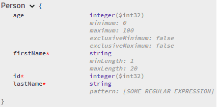
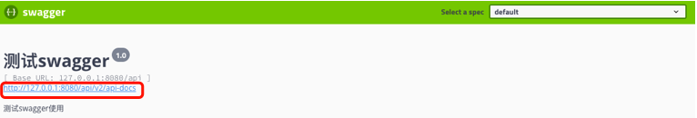
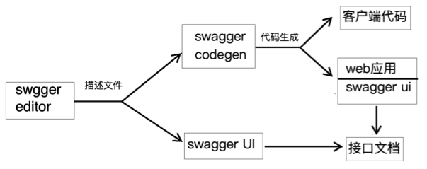
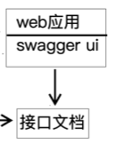

# swagger

## 入门

> 参考资料：
>
> + [微服务学习二：springboot与swagger2的集成 - 小虾米的java梦 - 博客园](https://www.cnblogs.com/fengli9998/p/7522973.html) 
> + [swagger搭建（基于springBoot）](https://blog.csdn.net/penyoudi1/article/details/79067386) 

+ pom

  ```xml
  <dependency>
      <groupId>io.springfox</groupId>
      <artifactId>springfox-swagger-ui</artifactId>
      <version>2.9.2</version>
  </dependency>
  <dependency>
      <groupId>io.springfox</groupId>
      <artifactId>springfox-swagger2</artifactId>
      <version>2.9.2</version>
  </dependency>
  ```

+ `Swagger2配置类`

  ```java
  @Configuration
  @EnableSwagger2
  public class Swagger2 {
      @Bean
      public Docket createRestApi() {
          return new Docket(DocumentationType.SWAGGER_2)
                  .apiInfo(apiInfo())
                  .select()
                  //为当前包路径
                  .apis(RequestHandlerSelectors.basePackage("com.shuyan.swagger"))
                  .paths(PathSelectors.any())
                  .build();
      }
  
      private ApiInfo apiInfo() {
          return new ApiInfoBuilder()
                  //页面标题
                  .title("测试swagger")
                  //创建人、个人门户网站、邮箱
                  .contact(new Contact("Will", "https://www.github.com/Mshuyan", "434224591@qq.com"))
                  //版本号
                  .version("1.0")
                  //描述
                  .description("测试swagger使用")
                  .build();
      }
  }
  ```

+ `Controller`

  ```java
  @RestController
  @Api(tags = "测试swagger相关的api",description = "TestController")
  public class TestController {
  
      @ApiOperation(value = "根据关键字查询产品列表", notes = "根据关键字查询产品列表 note")
      @ApiImplicitParams({
              @ApiImplicitParam(name = "str", value = "要说的话", paramType = "query",required = true, dataType = "String")
      })
      // 当只有1个参数时，上面注解可替换为：
      // @ApiImplicitParam(name = "keywords", value = "关键字，以空格分割", required = true, dataType = "String")
  
      @GetMapping("/test")
      public String test(String str){
          return "you said " + str;
      }
  }
  ```

+ 启动项目并访问

  > 项目根路径  +  /swagger-ui.html
  >
  > 比如本次测试访问路径为`http://127.0.0.1:8080/api/swagger-ui.html`
  >
  > 结果如下图：

   

  > 代码中的配置在页面上都能找到对应的内容

## 使用说明

### 概念

#### resource

指的是一组接口的1个分类，一般对应`Controller`

`resource`是根据`tag`生成的

#### operation

指的是1个接口

#### model

+ 就是接收json对象和响应json对象时需要用到的实体类

+ 入参时，只有使用`@RequestBody`接收请求参数的实体类才会作为`model`展示

+ 当1个`model`继承另1个`model`时，被继承`model`中对属性的描述也会被继承下来
+ `model`一般使用[@ApiModel](# @ApiModel)和[@ApiModelProperty](#@ApiModelProperty)注解进行说明
+ 要忽略某个属性时，使用`@JsonIgnore`注解，或[@ApiModelProperty](#@ApiModelProperty)的`hidden`属性即可

### 设置scheme

+ 全局配置

  ```java
  @Bean
  public Docket createRestApi() {
      HashSet<String> protocols = new HashSet<>();
      protocols.add("http");
      protocols.add("https");
      return new Docket(DocumentationType.SWAGGER_2)
          .protocols(protocols)		// 设置scheme
  ```

+ 效果

   

+ 经过测试，`swagger`相关注解中的`schemes`或`protocols`属性并没有效果

### 全局定义响应消息

```java
@Configuration
@EnableSwagger2
@ConditionalOnProperty(prefix = "spring",value = {"profiles.active"},havingValue = "dev")
public class Swagger2 {
    @Bean
    public Docket createRestApi() {
        return new Docket(DocumentationType.SWAGGER_2)
                .apiInfo(apiInfo())
                .globalResponseMessage(RequestMethod.GET,responseMessages())
                .globalResponseMessage(RequestMethod.HEAD,responseMessages())
                .globalResponseMessage(RequestMethod.POST,responseMessages())
                .globalResponseMessage(RequestMethod.PUT,responseMessages())
                .globalResponseMessage(RequestMethod.PATCH,responseMessages())
                .globalResponseMessage(RequestMethod.DELETE,responseMessages())
                .globalResponseMessage(RequestMethod.OPTIONS,responseMessages())
                .globalResponseMessage(RequestMethod.TRACE,responseMessages())
                .select()
                //为当前包路径
                .apis(RequestHandlerSelectors.basePackage("com.rjs.cpmall.buyer"))
                .paths(PathSelectors.any())
                .build();
    }

    private ApiInfo apiInfo() {
        return new ApiInfoBuilder()
                //页面标题
                .title("cpmall 正版软件商城 买家平台")
                //创建人、个人门户网站、邮箱
                .contact(new Contact("Will", "https://www.github.com/Mshuyan", "434224591@qq.com"))
                //版本号
                .version("1.0")
                //描述
                .description("买家平台接口文档")
                .build();
    }

    private List<ResponseMessage> responseMessages(){
        List<ResponseMessage> responseMessageList = new ArrayList<>();
        Map<String, Header> headers = new HashMap<>(4);
        headers.put("token",new Header("token","jwt令牌",new ModelRef("string")));
        responseMessageList.add(new ResponseMessageBuilder().code(200).message("ok").headersWithDescription(headers).build());
        responseMessageList.add(new ResponseMessageBuilder().code(400).message("请求参数错误").responseModel(new ModelRef("MessageResponse")).build());
        responseMessageList.add(new ResponseMessageBuilder().code(401).message("未授权/授权失败").responseModel(new ModelRef("MessageResponse")).build());
        responseMessageList.add(new ResponseMessageBuilder().code(404).message("路由不存在").responseModel(new ModelRef("MessageResponse")).build());
        responseMessageList.add(new ResponseMessageBuilder().code(405).message("不支持的请求方法").responseModel(new ModelRef("MessageResponse")).build());
        responseMessageList.add(new ResponseMessageBuilder().code(500).message("服务器内部错误").responseModel(new ModelRef("MessageResponse")).build());
        return responseMessageList;
    }
}
```

`new ModelRef("MessageResponse")`中的`MessageResponse`是1个实体类类名，该类即使使用了`@ApiModel`注解，依然无法被`swagger`扫描到，会在`swagger`页面中报如下错误：

```
Resolver error at paths./login.post.responses.400.schema.$ref
Could not resolve reference because of: Could not resolve pointer: /definitions/MessageResponse does not exist in document
```

因为`MessageResponse`这个model还没有被注册到`swagger`中，需要在`Controller`中的某个接口上做如下配置，让swagger能找到这个model：

```java
@ApiResponses({
    @ApiResponse(code = 400,message = "请求参数错误",response = MessageResponse.class)
})
```

### 全局定义请求参数

> 参考资料：
>
> - [swagger ui 添加header请求头参数](https://blog.csdn.net/uncle_david/article/details/79283422) 

```java
public Docket customDocket(){
    ParameterBuilder ticketPar = new ParameterBuilder();
    List<Parameter> pars = new ArrayList<Parameter>();  
    ticketPar.name("ticket").description("user ticket")
        .modelRef(new ModelRef("string")).parameterType("header") 
        .required(false).build(); //header中的ticket参数非必填，传空也可以
    pars.add(ticketPar.build());    //根据每个方法名也知道当前方法在设置什么参数

    return new Docket(DocumentationType.SWAGGER_2)
        .select()
        .apis(RequestHandlerSelectors.any())  
        .build()  
        .globalOperationParameters(pars)  
        .apiInfo(apiInfo());
}
```

### 访问安全API

> swagger中的鉴权分为3种：`Apikey`、`OAuth2`、`BasicAuth`

> 资料参见：
>
> - [swagger-api(GITHUB)](https://github.com/swagger-api/swagger-core/wiki/Annotations-1.5.X) 
>
> 有些接口需要token才能访问，进行如下配置后，就不用手动配置并输入token了
>
> 在正常swagger配置上，需要加入如下这段配置：

```java
@Configuration
@EnableSwagger2
@ConditionalOnProperty(prefix = "spring", value = {"profiles.active"}, havingValue = "dev")
@Import(BeanValidatorPluginsConfiguration.class)
public class Swagger2 {
    @Bean
    public Docket createRestApi() {
        // 其他配置
        Swagger2Util swaggerBean = new Swagger2Util("后台管理接口文档", "产业地图 后台管理", "com.rjs.industry.map");
        Docket docket = swaggerBean.createRestApi();
        // security swagger相关配置
        docket.securitySchemes(securitySchemes())
        return docket;
    }

    private List<ApiKey> securitySchemes() {
        List<ApiKey> list = new ArrayList<>();
        /*
         * name：页面显示名称
         * keyname：自动携带的参数名称
         * passAs：自动携带的参数类型
         */
        list.add(new ApiKey("Authorization", "X-Auth-Token", "header"));
        return list;
    }
}
```

然后在需要进行认证的接口上使用如下注解，表示该接口需要token

```java
@ApiOperation(value = "获取权限列表",
            notes = "需要登陆",
            authorizations = {
                    @Authorization("Authorization")
            })
```

### 生产环境禁用swagger

> 参见[swagger搭建（基于springBoot）](https://blog.csdn.net/penyoudi1/article/details/79067386) 

- 为什么禁用

  > swagger在开发过程中好用，但是生产环境下必须屏蔽swagger，不然很容易让人利用swagger执行对库操作，安全隐患非常大

- 如何禁用

  > 在`swagger`配置类上加上条件注解实现生成环境禁用

  ```java
  @Configuration
  @EnableSwagger2
  @ConditionalOnProperty(prefix = "spring",value = {"profiles.active"},havingValue = "dev")
  public class Swagger2 {
      ......
  }
  ```

  > @ConditionalOnProperty作用
  >
  > 当配置文件中`spring.profiles.active`的值为`dev`时，加载该配置类

### 显示校验规则

> 参考资料：[Documenting Spring Boot REST API with Swagger and SpringFox](https://www.vojtechruzicka.com/documenting-spring-boot-rest-api-swagger-springfox/) 

实际项目开发中，我们需要对请求参数进行校验，如：

```java
public class Person {
    @NotNull
    private int id;

    @NotBlank
    @Size(min = 1, max = 20)
    private String firstName;

    @NotBlank
    @Pattern(regexp ="[SOME REGULAR EXPRESSION]")
    private String lastName;

    @Min(0)
    @Max(100)
    private int age;

    //... Constructor, getters, setters, ...
}
```

此时，我们希望`swagger`生成的接口文档是这样的：

 

为了达到这个效果，我们可以进行如下配置：

- pom

  ```xml
  <dependency>
      <groupId>io.springfox</groupId>
      <artifactId>springfox-bean-validators</artifactId>
      <version>2.9.2</version>
  </dependency>
  ```

- `swagger`配置类上加上1个`Import`注解

  ```java
  @Configuration
  @EnableSwagger2
  @ConditionalOnProperty(prefix = "spring",value = {"profiles.active"},havingValue = "dev")
  @Import(BeanValidatorPluginsConfiguration.class)
  public class Swagger2 {
  ```

### 文件上传

> 参见[swagger文件上传的写法](https://blog.csdn.net/qq_23167527/article/details/78559096) 
>
> `swagger`并不支持`MultipartFile[] files`这样的多文件上传，参见：[Swagger填坑](http://www.voidcn.com/article/p-arceivzd-od.html) 

```java
@ApiOperation(value = "上传图片",
              notes = "需要权限：ROLE_Article_images_upload",
              authorizations = {
                  @Authorization("Authorization")
              })
@ApiImplicitParam(name = "type", value = "图片类型；1:轮播图；2：文章图片", required = true, allowableValues = "1,2", paramType = "form", dataType = "int", example = "1")
@Secured("ROLE_Article_images_upload")
// 1. 必须指定Content-Type为multipart/form-data
@PostMapping(value = "/images", consumes = MediaType.MULTIPART_FORM_DAform-data
// 2. 必须使用 @ApiParam，不能使用 @ApiImplicitParam
public UploadResultDto upload(@ApiParam(value = "上传图片数组", required = true)
                              @NotEmpty(message = "{common.notNull}") MultipartFile[] files,
                              @Min(value = 1, message = "{common.notAllow}") @Max(value = 2, message = "{common.notAllow}") @NotNull(message = "{common.notNull}") Integer type) {
    for (MultipartFile file : files) {
        if (!file.getOriginalFilename().matches("^.+.\\w+$")) {
            throw new ParamsInvalidException(2001, "文件名格式错误");
        }
    }
    return articleServiceImpl.uploadImages(files, type);
}
```

## 注解

### 说明

> 声名：
>
> + 过时和测试后发现没有作用的注解或属性将不做介绍
>
> + 斜体表示不常用

#### @Api

- 作用域：类，一般标注在`Controller`类上

- 功能

  - 根据`tags`属性建立n个`resource`，并对这些`resource`进行说明
  - 该注解标注的`controller`中的接口，在每个`resource`中都会进行展示
  - 该注解中的其他属性，会作用到每个`resource`上
  - 具备相同`tag`的`resource`或接口，会被集中在1个`resource`中进行展示

- 属性

  - tags
    - 类型：String[]
    - 功能：根据`tags`数组大小建立n个`resource`，每个元素的值就是`resource`名称
    - 注意：一般`tags`不会设置多值

- 例

  ```java
  @Api(tags = "测试swagger相关的api")
  @RestController
  public class TestController {
  ```

#### @ApiImplicitParam

- 作用域：方法上、或作为`@ApiImplicitParams`注解`value`属性的值

- 功能：用于对接口的参数进行描述

- 属性

  - name
    - 类型：String
    - 功能：指定要描述的参数名
  - value
    - 类型：String
    - 功能：对该参数进行说明
  - defaultValue
    - 类型：String
    - 功能：显示该参数默认值
  - allowableValues
    - 类型：String
    - 功能：显示可以使用哪些值
    - 有效值：使用`,`分割的字符串
  - required
    - 类型：Boolean
    - 功能：用于指定该值是否必传
  - allowMultiple
    - 类型：boolean
    - 功能：设置是否是数组类型
  - dataType
    - 类型：string
    - 功能：设置数据类型，可以设置为类名(如："TestDto")或基本类型(如："string")
  - paramType
    - 类型：String
    - 功能：请求参数类型
    - 可选值
      - path，路径参数，如`/api/test/{id}`
      - query，url请求参数，如`/api/test?id=1`
      - header，请求头参数
      - form，使用form表单提交参数；当`Content-Type`为如下值时，使用该方式
        - multipart/form-data
        - application/x-www-form-urlencoded
      - body，当`Content-type`为`application/json`时，使用该方式
  - example
    - 类型：String
    - 功能：显示该参数的示例，仅用于不是使用`@RequestBody`接收的参数
    - 注意：对于数值类型的参数，必须指定该属性，否则会抛异常，参见[数值类型转换出错](#数值类型转换出错) 

- 说明：

  - 当只有1个需要描述的参数时，该注解可以直接作用在接口方法上

    ```java
    @ApiImplicitParam(name = "id", value = "Long 类型", required = true, dataType = "Long",example = "1",paramType = "header")
    @GetMapping("/test/{id}")
    public String testLong(Long id){
    ```

    当有多个需要描述的参数时，该注解需要作为`@ApiImplicitParams`注解`value`属性的值使用

    ```java
    @ApiImplicitParams({
        @ApiImplicitParam(name = "type", value = "文章类型", required = true, example = "1", dataType = "int", paramType = "query"),
        @ApiImplicitParam(name = "pageNum", value = "当前页", dataType = "int", defaultValue = "1", example = "1"),
        @ApiImplicitParam(name = "pageSize", value = "每页大小", dataType = "int", defaultValue = "20", example = "20")
    })
    @GetMapping("/article/list")
    public PageInfo<ArticleResultDto> getArticleListByType(@RequestParam(defaultValue = "1") Integer pageNum,
                                                           @RequestParam(defaultValue = "20") Integer pageSize,
                                                           @NotNull(message = "{common.notNull}") Integer type) {
    ```

  - 对于不是以`@RequestBody`注解接收的请求参数，即使是以实体类对象接收的请求参数，也可以使用该注解直接对请求参数进行描述

    ```java
    @ApiImplicitParams({
        @ApiImplicitParam(name = "str", value = "要说的话", required = true,paramType = "form"),
        @ApiImplicitParam(name = "id", value = "订单id",required = true,paramType = "form")
    })
    @PostMapping(value = "/test")
    public String test(String str, TestDto dto){
    ```

    而对于以`@RequestBody`注解接收的请求参数，则使用该注解对请求参数进行描述，只能对实体类对象进行描述，甚至可以不描述

    ```java
    // 这个描述其实没什么意义，可以不加
    @ApiImplicitParam(name = "dto", value = "提交订单请求参数对象",dataType = "TestDto")
    @PostMapping(value = "/test",consumes = MediaType.APPLICATION_JSON_VALUE)
    public String test(@RequestBody TestDto dto){
    ```

#### @ApiImplicitParams

- 作用域：方法上
- 功能：当需要使用多个`@ApiImplicitParam`注解对参数进行描述时，使用本注解对这些描述进行管理
- 属性
  - value
    - 类型：ApiImplicitParam[]
    - 功能：当需要使用多个`@ApiImplicitParam`注解对参数进行描述时，使用本注解对这些描述进行管理

#### @ApiModel

- 作用域：类，一般用于实体类上
- 功能：描述`model`
- 属性
  - value
    - 类型：String
    - 功能：给`model`指定1个名字，默认使用类型
    - 注意：其他注解可以使用`dataType`指定为该值，用以引用该`model`，所以一般不要改变该属性
  - description
    - 类型：String
    - 功能：该`model`的描述信息

#### @ApiModelProperty

- 作用域：属性、getset方法上
- 功能：描述实体类中属性
- 说明：既可以描述`model`中属性，又可以描述请求参数
- 属性
  - name
    - 类型：String
    - 功能：指定要显示的属性名，默认是实体类中属性名，一般不要修改该值
  - value
    - 类型：String
    - 功能：对该属性进行说明
  - allowableValues
    - 类型：String
    - 作用：指定取值范围
    - 有效值：
      - 使用`,`分割的字符串
      - "range[1, 5)"：左闭右开区间1~5
      - "range[0, -infinity]"：0到负无穷
  - dataType：属性类型
  - required：是否必传
  - *position*
    - *类型：int*
    - *功能：指定属性在`model`中的排序位置*
  - hidden
    - 类型：boolean
    - 功能：指定是否在`model`中隐藏该属性
  - example：示例值

#### @ApiOperation

- 作用域：接口方法上

- 功能：描述接口

- 属性

  - value

    - 类型：String
    - 功能：指定接口摘要信息

  - notes

    - 类型：String
    - 功能：指定详细描述

  - *tags*

    - *类型：String[]*
    - *功能：除了将该接口展示在当前`resource`下之外，还要展示在哪些`resource`下*

  - *response*

    - *类型：Class<?>*

    - *功能：指定接口返回值类型*

    - *注意：*

      - *一般会自动检查返回值类型，一般不需要指定该属性*

      - *如果返回值为集合类型，该属性指定的是集合内指定的泛型类型，集合类型需要使用`responseContainer`属性来指定，如：*

        ```java
        // 如果需要指定返回值类型为 List<String>，则应该按如下方式指定
        @ApiOperation(response=String.class,responseContainer="list")
        ```

  - *responseContainer*

    - *类型：String*
    - *功能：指定返回值的集合类型*
    - *有效值：`list`、`set`、`map`*
    - *注意：只有明确指定了`response`属性时，该属性才起效*

  - *httpMethod*

    - *类型：String*
    - *功能：指定请求类型，一般不需要指定该属性*
    - *有效值：`GET`, `HEAD`, `POST`, `PUT`, `DELETE`, `OPTIONS`, `PATCH`；注意必须大写*

  - *nickname*

    - *类型：String*
    - *功能：指定唯一标识符，一般用于第三方工具*
    - *说明：一般不需要指定*

  - produces

    - 类型：String
    - 功能：指定响应的`Content-type`头
    - 说明：响应的`Content-type`头也可以通过`@RequestMapping`注解的`produces`属性指定

  - consumes

    - 类型：String
    - 功能：指定请求的`Content-type`头
    - 说明：请求的`Content-type`头也可以通过`@RequestMapping`注解的`consumes`属性指定

  - authorizations

    - 类型：Authorization[]
    - 功能：指定需要在该接口上使用哪种安全策略
    - 有效值：[@Authorization](# @Authorization)注解的数组
    - 说明：指定的安全策略需要在`swagger配置类`中指定，参见[访问安全API](#访问安全API) 

  - hidden

    - 类型：boolean
    - 功能：指定是否隐藏该接口

- 说明：注释说可以放在类上，测试后发现没有效果

#### @ApiParam

+ 作用域：参数列表、属性、getset方法

+ 功能：描述请求参数

+ 说明：仅能对请求参数进行描述，不能对`model`中属性进行描述

+ 属性

  > 相对于[@ApiImplicitParam](# @ApiImplicitParam)注解，少了如下3个属性：
  >
  > + dataType
  > + dataTypeClass
  > + paramType
  >
  > 多了`hidden`属性，其他属性均相同

#### @ApiResponse

+ 作用域：用于[@ApiResponses](# @ApiResponses)注解的属性值

+ 功能：对各种状态码的响应信息进行描述

+ 说明：注释说作用域方法上，经测试直接作用域接口方法上时无效

+ 属性：

  + code

    + 类型：int
    + 功能：要对哪种状态码的响应进行描述

  + message

    + 类型：String
    + 功能：描述信息

  + response、responseContainer

    > 这两个属性的作用及用法，与[@ApiOperation](# @ApiOperation)注解中的`response、responseContainer`属性完全相同

  + responseHeaders

    + 类型：ResponseHeader[]
    + 功能：指定响应头信息，值为[@ResponseHeader](# @ResponseHeader)注解的数组

#### @ApiResponses

+ 作用域：接口方法、controller类
+ 功能：对其所标注的接口的响应信息进行描述
+ 说明：
  + 当用于接口方法时，仅对该接口描述，作用域`controller`类时，该类下的所有接口进行描述
+ 属性
  + value
    + 类型：ApiResponse[]
    + 功能：用于管理多条对该接口的响应的描述
    + 有效值：[@ApiResponse](# @ApiResponse)注解的数组

#### @Authorization

+ 作用域：[@ApiOperation](# @ApiOperation)注解的`Authorizations`属性值
+ 功能：用于指定接口使用哪几种安全策略
+ 说明：注释说可以作用域方法，经测试无效
+ 属性
  + value
    + 类型：String
    + 功能：需要的使用的安全策略名称
    + 说明：参见[访问安全API](#访问安全API) 

#### @ResponseHeader

+ 作用域：[@ApiResponse](# @ApoResponse)注解的`responseHeader`的属性值

+ 功能：用于描述响应头

+ 说明：注释桌可以用于方法上，经测试用于方法上时无效

+ 属性：

  + name
    + 类型：Stirng
    + 功能：响应头名称
  + description
    + 类型：String
    + 功能：响应头描述信息
  + response
    + 类型：Class<?>
    + 功能：指定响应头类型，一般为`String.class`
  + *responseContainer*
    + *类型：String*
    + *功能：指定响应头的`value`值的集合类型*
    + *有效值*
      + *list*
      + *set*

+ 例

  ```java
  @ApiResponses({
    @ApiResponse(code = 200,message = "成功",responseHeaders = @ResponseHeader(name = "test",response = String.class,description = "test111",responseContainer = "list"))
  })
  ```

## 生成离线文档

> 生成`markdown`文档

### meven插件生成

- pom

  > 加入如下插件

  ```xml
  <plugin>
      <groupId>io.github.swagger2markup</groupId>
      <artifactId>swagger2markup-maven-plugin</artifactId>
      <version>1.3.7</version>
      <configuration>
          <!--此处端口一定要是当前项目启动所用的端口-->
          <swaggerInput>http://localhost:8080/api/v2/api-docs</swaggerInput>
          <outputFile>doc/api-docs/asciidoc/api</outputFile>
          <config>
              <!-- 除了ASCIIDOC之外，还有MARKDOWN和CONFLUENCE_MARKUP可选 -->
              <swagger2markup.markupLanguage>MARKDOWN</swagger2markup.markupLanguage>
              <swagger2markup.pathsGroupedBy>TAGS</swagger2markup.pathsGroupedBy>
          </config>
      </configuration>
  </plugin>
  
  ```

  - `swaggerInput`

    填入下面截图中的内容

     

  - `outputFile`

    指定生成文件的路径及文件名

  - `swagger2markup.markupLanguage`

    指定生成文件的格式，可选值：

    - ASCIIDOC

      > 生成html、pdf离线文档时需要先转到该格式，然后将该格式再转为html、pdf

    - MARKDOWN

    - CONFLUENCE_MARKUP

      > 生成的文件是txt格式，内容格式比较特殊，应该也是作为中间文件使用的，暂时用不到

- 生成离线文档

  - 先启动项目

    > 启动项目后就可以正常访问在线文档了，也就能访问`swaggerInput`指定的接口了
    >
    > 该插件是从`swaggerInput`指定的接口中获取json数据来生成离线文档的

  - 执行插件

    > 执行`swagger2markup`插件，即可生成`markdown`格式的离线文档了

### 命令行生成

- 将[swagger2markup.zip](http://disk.bymyself.club/study/swagger2markup.zip)解压到某目录下

- 在该目录下执行如下命令

  ```shell
  $ ./swagger2markup http://localhost:8080/v2/api-docs
  ```

  其中的url参数是从下图中获得的

   

  执行成功后，则会在当前目录下生成`api-doc.md`文件，就是接口文档

## 总结

### 接受请求参数

描述请求参数可用的注解有3种，以下是每种注解的使用方法

+ 在参数列表中描述请求参数时，使用`@ApiParam`
+ 在接口方法上描述请求参数时，使用`@ApiImplicitParam`
+ 在实体类中描述请求参数时，无论`Content-type`是什么，使用`@ApiModelProperty`

### 在`interface`中描述

+ swagger描述信息单独提到`interface`


## 采坑记录

### 数值类型转换出错

- 异常

  > java.lang.NumberFormatException: For input string: ""

- 解决方案

  > 在使用`@ApiImplicitParams`或`@ApiModelProperty`注解对`long`或`int`类型属性进行说明时，必须指定`example`属性，并且必须为内容为数字的字符串

- 例

  ```java
  @ApiImplicitParam(name = "itemId", value = "产品id", paramType = "path", required = true, dataType = "Long",example = "0")
  ```

### 登录接口无法登陆

> 因为`/login`接口由security自动提供，所以无法通过注解显示在swagger上，所以在controller中定义1个没用的`/login`接口，用于在swagger中显示该接口

```java
@ApiOperation("登录")
@ApiImplicitParams({
    @ApiImplicitParam(name = "username", value = "用户名", paramType = "form", required = true),
    @ApiImplicitParam(name = "password", value = "密码", paramType = "form", required = true)
})
@ApiResponses({
    @ApiResponse(code = 400, message = "请求参数错误", response = MessageResponse.class)
})
@PostMapping(value = "/login")
public LoginResultDto login() {
    return null;
}
```

> + 此时使用swagger测试该接口，会发现始终无法获取到用户输入的`username`和`password`
>
> + 这是因为此时swagger提交的请求的`Content-Type`请求头为`application/json`，而security的`login`接口要求该请求头必须为`application/x-www-form-urlencoded`
> + 所以需要在`@PostMapping`注解上指定`consumes`属性为`MediaType.APPLICATION_FORM_URLENCODED_VALUE`

```java
@PostMapping(value = "/login",consumes = MediaType.APPLICATION_FORM_URLENCODED_VALUE)
```

### 对model中属性分组显示

+ 问题

  项目中有人对同1组接口使用同1个`query`实体接收参数，同1个`vo`返回数据，但是这些实体类是将多个接口用到的参数或属性整合到了1个实体类中，必然出现生成的接口文档出现多余的参数，或响应多余的字段

+ 结论

  为了解决这个问题，层想过对`model`中属性进行分组，类似于校验注解中的`groups`属性，结果一些尝试后想明白1个问题，在多处引用的`model`也只会在接口文档中描述1次，所以根本无法根据不同接口分别进行描述，所以这项功能根本无法实现

### TODO

+ [在`interface`中描述](# 在`interface`中描述) 

  

## swagger全家桶

### 介绍

> 参见[官网介绍](https://swagger.io/docs/open-source-tools/swagger-editor/) 

+ swagger tools

  + swagger editor

    这是1个可以搭建在本地的web应用程序，功能是可以使用`yml`语法在浏览器中编辑接口文档，并结合`swagger UI`在线预览，还可以导出`描述文件`用于其他`swagger`工具

  + swagger UI

    这是1个可以搭建在本地的web应用程序，功能是根据`swagger描述文件`生成好看的页面来展示接口文档

  + swagger codegen

    这是1个工具，功能是根据`swagger描述文件`反向生成代码

    生成的代码分为两类：

    + 服务端代码：就是提供这些接口的代码，如使用`spring`创建`web`应用提供这些接口

      服务端代码中集成了`swagger ui`和一些其他的`swagger`工具，启动应用后可以使用当前应用中提供的`swagger ui`页面展示当前应用中提供的接口（就是[swagger](#swagger)中的用法）

    + 客户端代码：就是访问这些接口的代码，如使用`javaScript`访问接口的代码

+ swagger hub

  + 集成`swagger editor`、`swagger UI`、`swagger codegen`三个工具的在线仓库，`swagger Hub`不是搭建在本地的，是官方提供的
  + `swagger Hub`分为免费版和付费版，付费版中提供了多人协作的功能

+ swagger inspector

  这是`swagger`的测试工具，用于对接口进行测试，类似于`postman`，不同的是多了1个使用测试过的接口直接转入到`swagger hub`中，生成在接口文档中的功能

### 总结

+ `swagger hub`基本等同于`swagger editor`+`swagger ui`+`swagger codegen`+`仓库功能`

+ `swagger editor`+`swagger ui`+`swagger codegen`的使用流程如下图

    

  使用`swagger edito`生成`描述文件`(`Json/YML`格式)，将`描述文件`交给`swagger ui`可以直接进行接口文档展示；将`描述文件`交给`swagger codegen`可以根据`描述文件`中的接口自动生成`客户端`、`服务端`代码，生成的服务端代码中集成了`swagger ui`，启用服务端应用后可以直接在浏览器中访问接口文档

+ [swagger](#swagger)中使用`swagger`的用法相当于下图这部分

   

  web应用中的代码不是使用`swagger codegen`生成的，而是自己集成的，但是同样集成`swagger ui`，启动应用后可以将当前应用中提供的接口展现在页面上


